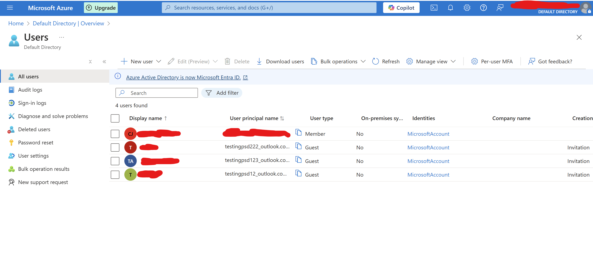

## Team 15 Accounting ERP for SMEs
The accounting system is a Progressive Web Application (PWA) designed to cater to Small and Medium Enterprises (SMEs). The system includes modules for tracking inventory and capturing/organizing receipts, providing users with essential financial tools accessible on both mobile and web-based platforms. The main objectives are to streamline accounting processes, enhance mobility with offline functionality and ensure real-time data synchronization when online. It can also be used to automate recurring tasks and provide insights into business performance.

## License

The Laravel framework is open-sourced software licensed under the [MIT license](https://opensource.org/licenses/MIT).


## TEAMPROJECT

## Prerequisites  
### 1. Install PHP  
Ensure that PHP is installed on your system. If not, download it from the official PHP website:  
[Download PHP 8.3](https://windows.php.net/download#php-8.3)  

This project requires **PHP version 8.3.16**, so make sure you are using the correct version to avoid compatibility issues.  

### 2. Install Dependencies  
Run the following command to install the required dependencies:  
```sh
composer install
```
### 3. CA cert installation
To enable secure HTTPS requests in PHP, you need to download and configure the CA certificate:

3.1 Download the latest cacert.pem file from https://curl.se/ca/cacert.pem.

3.2 Move the downloaded cacert.pem file to a secure location (e.g., C:\php\extras\ssl\cacert.pem on Windows).

3.3 Open your php.ini file (found in your PHP installation directory).

3.4 Add or edit the following lines in the file and update them with the correct path:
```
curl.cainfo = "C:\path\to\your\cacert.pem"
openssl.cafile = "C:\path\to\your\cacert.pem"
```

---

## Setting up of API keys in the .env file

1. **Configure Stripe Payment API**

Sign up for a Stripe account. Make sure you are in Test mode and update the following lines on your .env file with the API keys:
```
STRIPE_KEY= your_publishable_key
STRIPE_SECRET= your_secret_key
```

2. **Configure Asprise API Key**

Use the test API key in your `.env` file:

```sh
ASPRISE_OCR_API_KEY=TEST
```
3. **Configure Microsoft Authentication API**

[Read Additional Information below](#removing-authenticator) to disable this Microsoft login

Set up Microsoft Entra ID to make use of Active Directory to implement authentication

Find and edit the the following line with your own API keys and urls
```
MSGRAPH_CLIENT_ID=<your_client_id>
MSGRAPH_SECRET_ID=<your_secret_id>
MSGRAPH_TENANT_ID=<your_tenant_id>

MSGRAPH_OAUTH_URL=<oauth_url>
MSGRAPH_LANDING_URL=<landing_url>
MSGRAPH_PREFER_TIMEZONE='outlook.timezone="Asia/Singapore"'
```

---

## Database setup

Login to MySQL:
```
mysql -u root -p
```
Enter the password
```
Run the SQL script "db_script_deployment.sql"
```
Next, update .env file with the necessary

---

## Running the application

To run on local device, open cmd run:
```
npm run dev
```
then open another cmd and run:
```
php artisan serve
```
To test if PWA feature is working properly, go to localhost:8000/testhome, should be able to see the download app button

---

### Additional Information
The API keys in .env file is not normally provided but is pushed into this git for testing purposes
Please replace with own API keys if using this Laravel project

#### Authentication
##### Authenticator Details
Please do take note that the current system is using and managed by our personal Entra account for demo and testing purposes. If anyone wants to use the system, they will need to follow instructions to set up Microsoft Entra ID and create their own API key and secret keys to replace in the .env file.

For authentication, the system is currently using Microsoft System to log in. In order to access the system, the Microsoft account that is being used must be part of an active directory stated (see image). Companies can easily add groups of people that they would like to give access to by configuring it on the Azure portal.



##### Removing Authenticator
Each page of the web application is currently locked and requires the user to be signed in using an authorized account to access any of the pages. However, the company is able to switch to allow all pages to be accessed by editing the routing file (`web.php`). Instructions have been included in the file on which parts to comment or uncomment to either lock the web application behind Microsoft login or remove the authentication system entirely.

The test Microsoft account email and password will be sent in the email attached.
